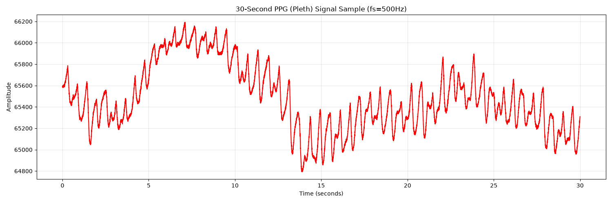
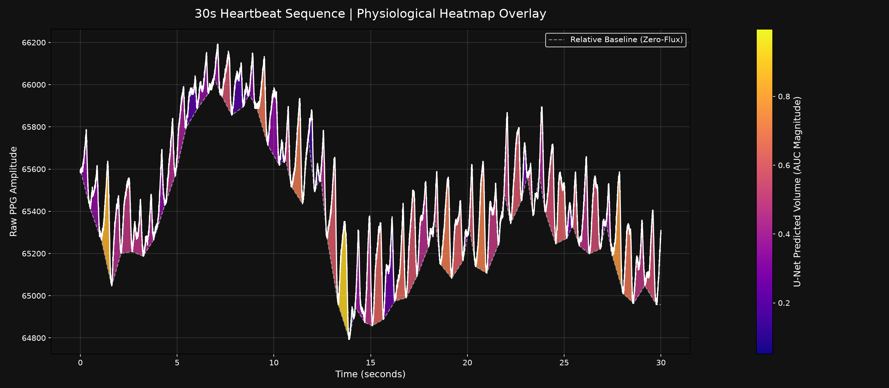
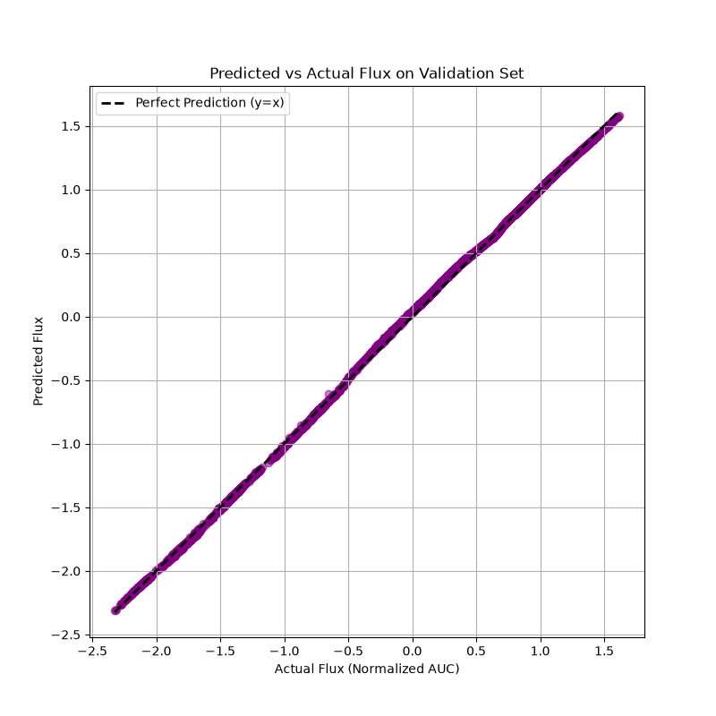

# 1-D-CNN-Flux

## PTT-PPG Dataset
This repository contains the code and resources for working with the [PTT-PPG](https://tsmd.readthedocs.io/en/latest/datasets/PTT-PPG.html#example-of-time-series-snippet) dataset. The `ptt-ppg` folder (ignored in version control) contains the raw dataset files.

Mehrgardt, P., Khushi, M., Poon, S., & Withana, A. (2022). Pulse Transit Time PPG Dataset (version 1.1.0). PhysioNet. RRID:SCR_007345. https://doi.org/10.13026/jpan-6n92

## Project Goal
The primary objective of this project is to create a 1-Dimensional Sequence to Sequence U-Net to predict or calculate the Area Under the Curve (AUC) of the Photoplethysmogram (PPG) signal. Measuring the AUC of the PPG signal allows us to estimate and monitor blood volume changes.

## Raw PPG Signal
The raw physiological dataset consists of continuous PPG windows, sliced into exact 1000-sample sequences (e.g. roughly 10 seconds at 100Hz).

## U-Net Architecture & Predictions
We successfully trained continuous sequence-to-sequence **1-D U-Net**. This architecture accepts the raw 1000-sample window and outputs a continuous 1000-sample array, forming a stepped, relative baseline under the peaks that dynamically visualizes individual heartbeat AUC (blood volume). 

## Model Evaluation
Our validation process directly evaluates how well the generated sequence aligns with calculated physiological targets. Below is the loss plot tracking predicted vs actual performance throughout the validation set.

